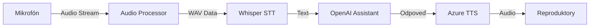

# Elena - Cyberpunk Twitch AI 🤖

[English below](#english)

## Slovensky

AI asistentka pre Twitch streamy s podporou viacerých jazykov pomocou Azure TTS. Predvolene nastavená na slovenčinu, ale podporuje aj iné jazyky vďaka Whisper STT a Azure TTS. Komunikuje cez mikrofón a reaguje v reálnom čase.

### 🌍 Jazyková podpora

#### Speech-to-Text (Whisper)
- Podporuje 99 jazykov vrátane všetkých hlavných európskych jazykov
- Najbežnejšie kódy jazykov:
  - `sk` - Slovenčina
  - `cs` - Čeština
  - `en` - Angličtina
  - `de` - Nemčina
  - `pl` - Poľština
  - `hu` - Maďarčina
  - `uk` - Ukrajinčina
- [Kompletný zoznam jazykov Whisper](https://github.com/openai/whisper/blob/main/whisper/tokenizer.py#L10)

#### Text-to-Speech (Azure)
- Viac ako 400 hlasov v 100+ jazykoch
- Najbežnejšie hlasy pre náš región:
  ```
  sk-SK-ViktoriaNeural    # Slovenčina (žena)
  sk-SK-LukasNeural       # Slovenčina (muž)
  cs-CZ-VlastaNeural      # Čeština (žena)
  cs-CZ-AntoninNeural     # Čeština (muž)
  en-US-JennyNeural       # Angličtina US (žena)
  en-GB-SoniaNeural       # Angličtina UK (žena)
  de-DE-KatjaNeural       # Nemčina (žena)
  pl-PL-AgnieszkaNeural   # Poľština (žena)
  hu-HU-NoemiNeural       # Maďarčina (žena)
  uk-UA-PolinaNeural      # Ukrajinčina (žena)
  ```
- [Kompletný zoznam Azure hlasov](https://learn.microsoft.com/en-us/azure/ai-services/speech-service/language-support?tabs=tts)

**Zmena jazyka**:
1. V `config.yaml` nastavte `language` pre Whisper
2. V `.env` nastavte `AZURE_SPEECH_VOICE` na požadovaný hlas
3. Odporúčame používať rovnaký jazyk pre STT aj TTS

### 💰 Cenové informácie

Projekt využíva platené služby:

#### OpenAI Assistant API
- Vyžaduje platený OpenAI účet
- Assistant API s GPT-4-0125-preview (4.0-mini):
  - Input: $0.003 za 1K tokenov
  - Output: $0.006 za 1K tokenov
- Pri 40-minútovom streame (cca 100 interakcií):
  - Približne $0.80-1.50 za stream (záleží od dĺžky odpovedí)

#### Azure Speech Services
- Ponúka free tier: 500,000 znakov mesačne zadarmo
- Po vyčerpaní free kreditu:
  - Neural TTS: $16 za 1M znakov
  - Pri 100 odpovediach (cca 20,000 znakov): ~$0.32
- Región "West Europe" má výhodnú latenciu pre SK/CZ

⚠️ Odporúčame sledovať usage v dashboarde OpenAI a Azure, aby nedošlo k nečakaným poplatkom.

### ✨ Kľúčové vlastnosti

- 🎤 **Push-to-Talk**: Stlač a drž F12 pre nahrávanie
- 🎯 **Rýchla odozva**: Speech-to-Text aj generovanie odpovede do pár sekúnd 
- 🗣️ **Kvalitný slovenský hlas**: Azure Neural TTS (Viktória)
- ⚡ **GPU akcelerácia**: Whisper STT beží na CUDA
- 📊 **Live metriky**: Časy transkripcie a generovania odpovede
- 🎨 **Prehľadné UI**: Farebný výstup v termináli s emoji

### 🏗️ Architektúra



#### Komponenty
1. **Audio Processor** (`services/audio_processor.py`)
   - Nahráva a spracováva audio stream
   - Detekcia hlasovej aktivity (VAD)
   - Buffer management

2. **Speech-to-Text** (`core/pipeline.py`)
   - Whisper model pre transkripciu
   - CUDA akcelerácia
   - Jazyková detekcia

3. **AI Assistant** (`services/assistant.py`)
   - OpenAI GPT Assistant API
   - Kontextové spracovanie
   - Generovanie odpovedí

4. **Text-to-Speech** (`services/tts/azure_tts.py`)
   - Azure Neural TTS
   - Voice management
   - Audio synthesis queue

#### Dátový tok
1. Audio je zachytené v 16kHz/16-bit formáte
2. Whisper spracuje audio do textu
3. Text je poslaný do GPT Assistant API
4. Odpoveď je syntetizovaná cez Azure TTS
5. Audio je prehrané cez výstupné zariadenie

### 🛠️ Požiadavky

- Python 3.11+
- NVIDIA GPU (pre CUDA akceleráciu)
- OpenAI API kľúč (pre GPT asistenta)
- Azure Speech Services kľúč (pre TTS)
- Mikrofón a slúchadlá/reproduktory

### 📦 Inštalácia a spustenie

1. **Vytvorte a aktivujte prostredie:**
```bash
python -m venv .venv
.\.venv\Scripts\activate
```

2. **Nainštalujte závislosti:**
```bash
pip install -r requirements.txt
```

3. **Nastavte premenné prostredia:**
   - Skopírujte `.env.example` do `.env`
   - Vyplňte API kľúče pre OpenAI a Azure
   - Nastavte ASSISTANT_ID

4. **Spustite aplikáciu:**
```bash
python main.py
```

### 🎮 Použitie

- **Stlač a drž F12** pre začiatok nahrávania
- **Pusti F12** pre spracovanie a odpoveď
- **Ctrl+C** v termináli pre ukončenie

### 📊 Metriky a Monitoring

Pri každej interakcii sa zobrazujú:

- **Čas transkripcie**: Typicky 0.8-1.5s
- **Čas odpovede**: Typicky 4-7s
- **Celkový čas**: Súčet všetkých operácií
- **Detekovaný jazyk**: Jazyk + istota detekcie
- **Počet slov**: Pre transkripciu aj odpoveď

### 📝 Logovanie

Logy sa ukladajú do `logs/elena_stt_YYYYMMDD_HHMMSS.log` a obsahujú:
- Inicializáciu služieb
- Transkripcie a odpovede
- Chybové stavy
- Metriky a časovanie

### ⚙️ Detailná konfigurácia

#### Model (Whisper)
```yaml
model:
  size: "large-v2"         # Možnosti: tiny, base, small, medium, large-v2
  language: "sk"           # Kód jazyka (napr. sk, en, de, cs, ...)
  cuda:
    enabled: true         # GPU akcelerácia
    compute_type: "float16"  # Možnosti: float32, float16, int8
  cpu:
    compute_type: "int8"   # CPU fallback konfigurácia
  inference:
    beam_size: 5          # Beam search šírka
    best_of: 5            # Počet kandidátov
    temperature: 0.0      # Sampling teplota (0.0 = deterministické)
    vad_filter: true      # Detekcia ticha
    no_speech_threshold: 0.6  # Prah pre "ticho"
```

#### Audio
```yaml
audio:
  sample_rate: 16000      # Vzorkovacia frekvencia (Hz)
  channels: 1             # Mono audio
  blocksize: 1024         # ~64ms pri 16kHz
  pre_roll_sec: 0.25      # Nahrávanie pred prvým zvukom
  post_roll_sec: 0.25     # Dobeh po pustení PTT
  input_device_index: null # null = predvolený mikrofón
```

#### Ovládanie
```yaml
controls:
  ptt_key: "f12"         # Push-to-talk klávesa
  print_partials: false   # Debug priebežných výsledkov
```

#### Text-to-Speech
```yaml
tts:
  enabled: true          # Azure TTS
  provider: "azure"      # TTS provider
  voice: "sk-SK-ViktoriaNeural"
  rate: 1.0             # Rýchlosť reči (0.5 - 2.0)
  pitch: 0.0            # Výška hlasu (-2.0 - 2.0)
  volume: 1.0           # Hlasitosť (0.0 - 2.0)
  queue:
    max_size: 10        # Maximálna veľkosť fronty
```

### 🔧 Pokročilé nastavenia

#### Environment Variables
```bash
# OpenAI
OPENAI_API_KEY=your_key    # OpenAI API kľúč
ASSISTANT_ID=asst_xxx      # ID pripraveného asistenta

# Azure Speech
AZURE_SPEECH_KEY=your_key  # Azure Speech Services kľúč
AZURE_SPEECH_REGION=westeurope
AZURE_SPEECH_VOICE=sk-SK-ViktoriaNeural
```

#### Audio zariadenia
Pre výpis dostupných zariadení:
```bash
python -m sounddevice
```

#### CUDA Optimalizácia
Pre najlepší výkon:
- CUDA 11.8+
- cuDNN 8.9.7+
- PyTorch s CUDA podporou
- GPU s aspoň 4GB VRAM

### 🐛 Debug režim

Pre detailné logovanie:
```bash
python main.py --debug
```

Užitočné informácie v debug móde:
- CUDA dostupnosť a verzia
- Audio device konfigurácia
- API latencie
- Memory usage
- Partial results

### ⚠️ Riešenie problémov

1. **No CUDA device available**
   - Skontrolujte `nvidia-smi`
   - Overte CUDA toolkit inštaláciu
   - Prejdite na CPU mód v config.yaml

2. **Audio zariadenie nenájdené**
   - Skontrolujte `python -m sounddevice`
   - Nastavte explicitný `input_device_index`

3. **TTS zlyhania**
   - Overte Azure kredity a kvóty
   - Skontrolujte internet pripojenie
   - Pozrite logy pre detaily

4. **Vysoká latencia**
   - Znížte Whisper model size
   - Zapnite CUDA akceleráciu
   - Upravte audio parametre

---

## English

An AI assistant for Twitch streams with multi-language support using Azure TTS. Preconfigured for Slovak but supports various languages through Whisper STT and Azure TTS. Communicates via microphone and responds in real-time.

### 🌍 Language Support

#### Speech-to-Text (Whisper)
- Supports 99 languages including all major European languages
- Most common language codes:
  - `sk` - Slovak
  - `cs` - Czech
  - `en` - English
  - `de` - German
  - `pl` - Polish
  - `hu` - Hungarian
  - `uk` - Ukrainian
- [Complete Whisper language list](https://github.com/openai/whisper/blob/main/whisper/tokenizer.py#L10)

#### Text-to-Speech (Azure)
- Over 400 voices in 100+ languages
- Most common voices for our region:
  ```
  sk-SK-ViktoriaNeural    # Slovak (female)
  sk-SK-LukasNeural       # Slovak (male)
  cs-CZ-VlastaNeural      # Czech (female)
  cs-CZ-AntoninNeural     # Czech (male)
  en-US-JennyNeural       # English US (female)
  en-GB-SoniaNeural       # English UK (female)
  de-DE-KatjaNeural       # German (female)
  pl-PL-AgnieszkaNeural   # Polish (female)
  hu-HU-NoemiNeural       # Hungarian (female)
  uk-UA-PolinaNeural      # Ukrainian (female)
  ```
- [Complete Azure voices list](https://learn.microsoft.com/en-us/azure/ai-services/speech-service/language-support?tabs=tts)

**Language Change**:
1. Set `language` in `config.yaml` for Whisper
2. Set `AZURE_SPEECH_VOICE` in `.env` to desired voice
3. We recommend using the same language for both STT and TTS

### 💰 Pricing Information

This project uses paid services:

#### OpenAI Assistant API
- Requires a paid OpenAI account
- Assistant API with GPT-4-0125-preview (4.0-mini):
  - Input: $0.003 per 1K tokens
  - Output: $0.006 per 1K tokens
- For a 40-minute stream (approx. 100 interactions):
  - Approximately $0.80-1.50 per stream (depends on response lengths)

#### Azure Speech Services
- Offers a free tier: 500,000 characters per month free
- After free credit is used:
  - Neural TTS: $16 per 1M characters
  - For 100 responses (approx. 20,000 characters): ~$0.32
- "West Europe" region provides favorable latency for SK/CZ

⚠️ We recommend monitoring usage in both OpenAI and Azure dashboards to avoid unexpected charges.

### ✨ Key Features

- 🎤 **Push-to-Talk**: Press and hold F12 to record
- 🎯 **Quick Response**: Speech-to-Text and response generation within seconds
- 🗣️ **Quality Slovak Voice**: Azure Neural TTS (Victoria)
- ⚡ **GPU Acceleration**: Whisper STT runs on CUDA
- 📊 **Live Metrics**: Transcription and response generation times
- 🎨 **Clear UI**: Colorful terminal output with emoji

### 🏗️ Architecture


#### Components
1. **Audio Processor** (`services/audio_processor.py`)
   - Records and processes audio stream
   - Voice Activity Detection (VAD)
   - Buffer management

2. **Speech-to-Text** (`core/pipeline.py`)
   - Whisper model for transcription
   - CUDA acceleration
   - Language detection

3. **AI Assistant** (`services/assistant.py`)
   - OpenAI GPT Assistant API
   - Context processing
   - Response generation

4. **Text-to-Speech** (`services/tts/azure_tts.py`)
   - Azure Neural TTS
   - Voice management
   - Audio synthesis queue

#### Data Flow
1. Audio is captured in 16kHz/16-bit format
2. Whisper processes audio to text
3. Text is sent to GPT Assistant API
4. Response is synthesized via Azure TTS
5. Audio is played through output device

### 🛠️ Requirements

- Python 3.11+
- NVIDIA GPU (for CUDA acceleration)
- OpenAI API key (for GPT assistant)
- Azure Speech Services key (for TTS)
- Microphone and headphones/speakers

### 📦 Installation and Launch

1. **Create and activate environment:**
```bash
python -m venv .venv
.\.venv\Scripts\activate
```

2. **Install dependencies:**
```bash
pip install -r requirements.txt
```

3. **Set environment variables:**
   - Copy `.env.example` to `.env`
   - Fill in API keys for OpenAI and Azure
   - Set ASSISTANT_ID

4. **Launch the application:**
```bash
python main.py
```

### 🎮 Usage

- **Press and hold F12** to start recording
- **Release F12** for processing and response
- **Ctrl+C** in terminal to exit

### 📊 Metrics and Monitoring

Each interaction displays:

- **Transcription Time**: Typically 0.8-1.5s
- **Response Time**: Typically 4-7s
- **Total Time**: Sum of all operations
- **Detected Language**: Language + detection confidence
- **Word Count**: For both transcription and response

### 📝 Logging

Logs are saved to `logs/elena_stt_YYYYMMDD_HHMMSS.log` and contain:
- Service initialization
- Transcriptions and responses
- Error states
- Metrics and timing

### ⚙️ Detailed Configuration

#### Model (Whisper)
```yaml
model:
  size: "large-v2"         # Options: tiny, base, small, medium, large-v2
  language: "sk"           # Language code (e.g., sk, en, de, cs, ...)
  cuda:
    enabled: true         # GPU acceleration
    compute_type: "float16"  # Options: float32, float16, int8
  cpu:
    compute_type: "int8"   # CPU fallback configuration
  inference:
    beam_size: 5          # Beam search width
    best_of: 5            # Number of candidates
    temperature: 0.0      # Sampling temperature (0.0 = deterministic)
    vad_filter: true      # Silence detection
    no_speech_threshold: 0.6  # Threshold for "silence"
```

#### Audio
```yaml
audio:
  sample_rate: 16000      # Sampling frequency (Hz)
  channels: 1             # Mono audio
  blocksize: 1024         # ~64ms at 16kHz
  pre_roll_sec: 0.25      # Recording before first sound
  post_roll_sec: 0.25     # Tail after PTT release
  input_device_index: null # null = default microphone
```

#### Controls
```yaml
controls:
  ptt_key: "f12"         # Push-to-talk key
  print_partials: false   # Debug intermediate results
```

#### Text-to-Speech
```yaml
tts:
  enabled: true          # Azure TTS
  provider: "azure"      # TTS provider
  voice: "sk-SK-ViktoriaNeural"
  rate: 1.0             # Speech rate (0.5 - 2.0)
  pitch: 0.0            # Voice pitch (-2.0 - 2.0)
  volume: 1.0           # Volume (0.0 - 2.0)
  queue:
    max_size: 10        # Maximum queue size
```

### 🔧 Advanced Settings

#### Environment Variables
```bash
# OpenAI
OPENAI_API_KEY=your_key    # OpenAI API key
ASSISTANT_ID=asst_xxx      # ID of prepared assistant

# Azure Speech
AZURE_SPEECH_KEY=your_key  # Azure Speech Services key
AZURE_SPEECH_REGION=westeurope
AZURE_SPEECH_VOICE=sk-SK-ViktoriaNeural
```

#### Audio Devices
To list available devices:
```bash
python -m sounddevice
```

#### CUDA Optimization
For best performance:
- CUDA 11.8+
- cuDNN 8.9.7+
- PyTorch with CUDA support
- GPU with at least 4GB VRAM

### 🐛 Debug Mode

For detailed logging:
```bash
python main.py --debug
```

Useful information in debug mode:
- CUDA availability and version
- Audio device configuration
- API latencies
- Memory usage
- Partial results

### ⚠️ Troubleshooting

1. **No CUDA device available**
   - Check `nvidia-smi`
   - Verify CUDA toolkit installation
   - Switch to CPU mode in config.yaml

2. **Audio device not found**
   - Check `python -m sounddevice`
   - Set explicit `input_device_index`

3. **TTS failures**
   - Verify Azure credits and quotas
   - Check internet connection
   - Look at logs for details

4. **High latency**
   - Reduce Whisper model size
   - Enable CUDA acceleration
   - Adjust audio parameters

### ℹ️ Contributing

Pull requests sú vítané. Pre väčšie zmeny, prosím, najprv otvorte issue pre diskusiu.

### 📄 License

[MIT](https://choosealicense.com/licenses/mit/)
